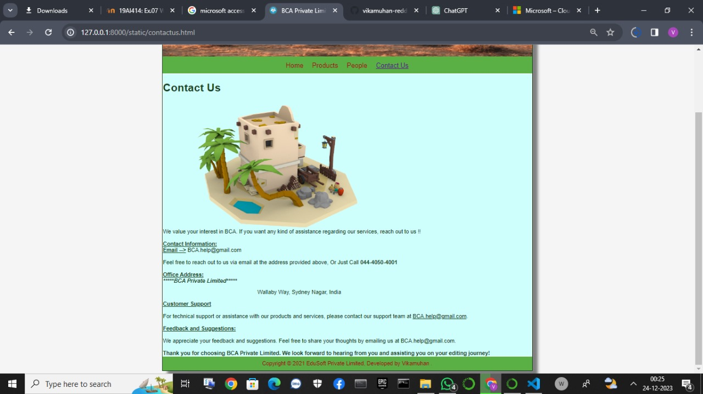

# Web Design for a Software Product Company

## AIM:

To design a static website for a software product company company.

## DESIGN STEPS:

### Step 1:

Requirement collection.

### Step 2:

Creating the layout using HTML and CSS.

### Step 3:

Updating the sample content.

### Step 4:

Choose the appropriate style and color scheme.

### Step 5:

Validate the layout in various browsers.

### Step 6:

Validate the HTML code.

### Step 6:

Publish the website in the given URL.

## PROGRAM :
home.html
```html
<!DOCTYPE html>
<html lang="en">
  <head>
    <title>BCA Private Limited</title>
    <link rel="stylesheet" href="./css/layout.css" />
    <link rel="icon" href="./img/icon.png" type="image/x-icon" />
  </head>

  <body>
    <div class="container">
      <div class="banner">BCA Private Limited.</div>
      <div class="menu">
        <div class="menuitemselected"><a href="/static/home.html">Home</a></div>
        <div class="menuitem"><a href="/static/products.html">Products</a></div>
        <div class="menuitem"><a>People</a></div>
        <div class="menuitem"><a>Contact Us</a></div>
      </div>
      <div class="content">
        <div class="homecontent">
          <h1>About Us</h1>
          
          <div class="contenttext">

            At BCA, we're committed to bringing you the best technological solutions tailored to your needs. 
            Partnering with industry leaders like Microsoft, we offer an extensive range of cutting-edge products designed to elevate your digital experience. 
            Our collaboration with Microsoft allows us to showcase an array of innovative tools and software that cater to various aspects of personal and professional computing. 
            From the renowned Microsoft Office suite, empowering seamless productivity, to robust operating systems like Windows that redefine efficiency, we provide access to the latest advancements from Microsoft.
            Whether you're a business seeking scalable enterprise solutions or an individual looking for reliable software, 
            BCA serves as your gateway to harnessing the power of Microsoft's exceptional products.

            <br />

            Discover a world of possibilities with our curated selection of Microsoft products at BCA. 
            Dive into the versatility of Microsoft 365, a comprehensive suite blending familiar applications like Word, Excel, and PowerPoint with powerful cloud services, ensuring productivity from anywhere, at any time. 
            Embrace the intuitive features of Windows 11, the latest evolution of Microsoft's operating system, offering a seamless and secure computing environment. Our range extends beyond software; delve into the realm of Surface devices, marrying cutting-edge hardware with Microsoft's software prowess for unparalleled performance. 
            Whether it's optimizing workflows with Azure cloud solutions or unlocking creativity with Surface Pen-enabled devices, BCA is your destination for accessing Microsoft's transformative products that redefine the boundaries of technology. 
            Explore, innovate, and elevate your digital journey with BCA and Microsoft.
            <ul>
              <li>Simple to learn, easier to use</li>
              <li>Insightful , actionable & customizable reports</li>
              <li>Anywhere, anytime and secure access</li>
            </ul>
          </div>
        </div>
      </div>
      <div class="footer">
        Copyright &#169; 2021 BCA Private Limited, Developed by Vikamuhan.
      </div>
    </div>
  </body>
</html>

```
products.html
```html
<!DOCTYPE html>
<html lang="en">
  <head>
    <title>BCA Private Limited</title>
    <link rel="stylesheet" href="./css/layout.css" />
    <link rel="icon" href="./img/icon.png" type="image/x-icon" />
  </head>

  <body>
    <div class="container">
      <div class="banner">BCA Private Limited.</div>
      <div class="menu">
        <div class="menuitem"><a href="./home.html">Home</a></div>
        <div class="menuitemselected">
          <a href="./products.html">Products</a>
        </div>
        <div class="menuitem"><a href="./people.html">People</a></div>
        <div class="menuitem"><a href="./contactus.html">Contact Us</a></div>
      </div>
      <div class="content">
        <div class="productcontent">    
          <h1>Our Premium Products</h1>
          <div class="productitems">
              <div class="productitem"> 
                  <div class="itemimage">
                  
                  </div>
                  <div class="itemname">Outlook</div>
                  <div class="itemprice">Price: Rs.4999.00 </div>
              </div>
              <div class="productitem"> 
                  <div class="itemimage">
                  
                  </div>
                  <div class="itemname">One Note</div>
                  <div class="itemprice">Price: Rs.7999.00 </div>
              </div>
              <div class="productitem"> 
                <div class="itemimage">
                
                </div>
                <div class="itemname">powerpoint</div>
                <div class="itemprice">Price: Rs.6999.00 </div>
              </div>
              <div class="productitem"> 
                <div class="itemimage">
                
                </div>
                <div class="itemname">Skype</div>
                <div class="itemprice">Price: Rs.1999.00 </div>
              </div>
              <div class="productitem"> 
                <div class="itemimage">
                
                </div>
                <div class="itemname">Teams</div>
                <div class="itemprice">Price: Rs.3000.00 </div>
              </div>
              <div class="productitem"> 
                <div class="itemimage">
                
                </div>
                <div class="itemname">Word</div>
                <div class="itemprice">Price: Rs.5999.00 </div>
              </div>
          </div>
          </div>
      
        <h1>Our Other Items</h1>  
        <div class="productitem"> 
          <div class="itemimage">
          
          </div>
          <div class="itemname">Onedrive</div>
          <div class="itemprice">Price: Rs.1999.00 </div>
        </div>
        <div class="productitem"> 
          <div class="itemimage">
          
          </div>
          <div class="itemname">Clipchamp</div>
          <div class="itemprice">Price: Rs.4999.00 </div>
        </div>
        <div class="productitem"> 
          <div class="itemimage">
          
          </div>
          <div class="itemname">Edge</div>
          <div class="itemprice">Price: Rs.3999.00 </div>
        </div>
        <div class="productitem"> 
          <div class="itemimage">
          
          </div>
          <div class="itemname">Excel</div>
          <div class="itemprice">Price: Rs.2999.00 </div>
        </div>
        <div class="productitem"> 
          <div class="itemimage">
          
          </div>
          <div class="itemname">Forms</div>
          <div class="itemprice">Price: Rs.3999.00 </div>
        </div>
        <div class="productitem"> 
          <div class="itemimage">
          
          </div>
          <div class="itemname">Access</div>
          <div class="itemprice">Price: Rs.2000.00 </div>
        </div>     
      </div>
      <div class="footer">
        Copyright &#169; 2021 BCA Private Limited, Developed by Vikamuhan.
      </div>
    </div>
  </body>
</html>

```
people.html
```html
<!DOCTYPE html>
<html lang="en">
  <head>
    <title>BCA Private Limited</title>
    <link rel="stylesheet" href="./css/layout.css" />
    <link rel="icon" href="./img/icon.png" type="image/x-icon" />
  </head>

  <body>
    <div class="container">
      <div class="banner">BCA Private Limited.</div>
      <div class="menu">
        <div class="menuitem"><a href="./home.html">Home</a></div>
        <div class="menuitem"><a href="./products.html">Products</a></div>
        <div class="menuitemselected"><a href = "./people.html">People</a></div>
        <div class="menuitem"><a href = "./contactus.html">Contact Us</a></div>
      </div>
    <div class="content">
      <div class="productcontent">    
        <h1>Our Staff !!</h1>
        <div class="productitems">
            <div class="productitem"> 
              <div class="itemimage">
              
              </div>
              <div class="itemname">Modi - CEO</div> 
            </div>
            <div class="productitem"> 
              <div class="itemimage">
              
              </div>
              <div class="itemname">Tate - Infulencer</div>
            </div>
            <div class="productitem"> 
              <div class="itemimage">
              
              </div>
              <div class="itemname">Trump - HR</div>
            </div>
            <div class="productitem"> 
              <div class="itemimage">
              
              </div>
              <div class="itemname">Mohan - Mascot</div>  
            </div>
            <div class="productitem"> 
              <div class="itemimage">
              
              </div>
              <div class="itemname"> Marran - Advertizer</div>  
            </div>
            <div class="productitem"> 
              <div class="itemimage">
              
              </div>
              <div class="itemname">Lisa </div>
            </div>
        </div>
      </div>        
    </div>
    <div class="footer">
        Copyright &#169; 2021 BCA Private Limited, Developed by Vikamuhan .
    </div>
    </div>
  </body>
</html>
```
contactus.html
```html
<!DOCTYPE html>
<html lang="en">
  <head>
    <title>BCA Private Limited</title>
    <link rel="stylesheet" href="./css/layout.css" />
    <link rel="icon" href="./img/icon.png" type="image/x-icon" />
  </head>

  <body>
    <div class="container">
      <div class="banner">BCA Private Limited.</div>
      <div class="menu">
        <div class="menuitem"><a href="./home.html">Home</a></div>
        <div class="menuitem"><a href="./products.html">Products</a></div>
        <div class="menuitem"><a href = "./people.html">People</a></div>
        <div class="menuitemselected"><a href = "./contactus.html">Contact Us</a></div>
      </div>
    <div class="content">
        <div class="contactcontent">
          <h1>Contact Us</h1>
          
          <div class="contcontenttext">
                      We value your interest in BCA. If you want any kind of assistance regarding our services, reach out to us !!
            <br>
            <br>
            <b><u>Contact Information:</u></b>
            <br>
            <b><u>Email --></u></b> BCA.help@gmail.com<br><br>

            Feel free to reach out to us via email at the address provided above, Or Just Call <b>044-4050-4001</b><br><br>

            <b><u>Office Address:</u></b><br>

            <b><i>*****BCA Private Limited*****</i></b><br>

                                                                         <pre>                                                              Wallaby Way, Sydney Nagar, India<br></pre>

                                                                         <b><u>Customer Support</u></b><br><br>

                                                                         For technical support or assistance with our products and services, please contact our support team at <u>BCA.help@gmail.com</u>.<br><br>

                                                                         <b><u>Feedback and Suggestions:</u></b><br><br>

                                                                         We appreciate your feedback and suggestions. Feel free to share your thoughts by emailing us at BCA.help@gmail.com.<br><br>

                                                                        <b> Thank you for choosing BCA Private Limited. We look forward to hearing from you and assisting you on your editing journey!</b>
          </div>
        </div>
      </div>
    <div class="footer">
        Copyright &#169; 2021 EduSoft Private Limited, Developed by Vikamuhan .
    </div>
    </div>
  </body>
</html>
    
```
## OUTPUT:

### Home Page:


### products page:


### people page:


### contactus page:


## Result:

Thus a website is designed for the software product company and the HTML,CSS code are validated.
